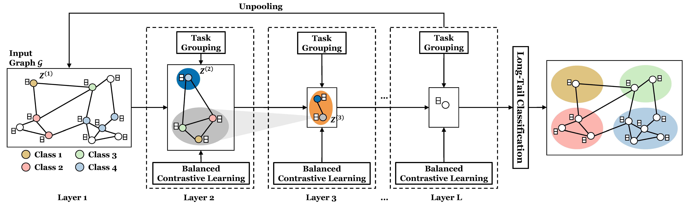

# Mastering Long-Tail Complexity on Graphs: Characterization, Learning, and Generalization

The key contributions of the paper are summarized as follows:
- **Problem Definition:** We formalize the long-tail classification problem on graphs and develop a novel metric named long-tailedness ratio for characterizing properties of long-tail distributed data.
- **Theory:** We derive a generalization bound for long-tail classification on graphs, which inspires our proposed framework.
- **Algorithm:** We propose a novel approach named HierTail that (1) extracts shareable information across classes via hierarchical task grouping and (2) balances the gradient contributions of head classes and tail classes.
- **Evaluation:** We identify six real-world datasets for long-tail classification on graphs. We systematically evaluate the performance of HierTail by comparing them with eleven baseline models. The results demonstrate the effectiveness of HierTail and verify our theoretical findings.

<div  align="center">
 
</div>

----

## Code Structure
```
HierTail
├── figs
├── models
│   ├── baseline       
│   |   ├── embed_smote    
│   |   ├── graphsmote_O              
│   |   ├── graphsmote_T              
│   |   ├── origin             
│   |   ├── oversampling
│   |   ├── reweight
│   |   ├── smote                       
│   ├── HierTail                          
├── sh                    # Examples of running the specific method
│   ├── run_cora_full
├── arg         
├── data_load         
├── embedder  
├── layers  
├── main 
├── utils        
└── README.md
```

## Quick Start

We provide the following example for users to quickly implementing HierTail.

### Step 1. Dependency

First of all, users need to clone the source code and install the required packages:

- torch
- torch-geometric
- torchvision
- numpy

### Step 2. Start running

Here we show how to run HierTail with default setting for a node classification task on Cora_Full dataset. Users can customize training configurations, such as `lr`, in the `run_cora_full.sh`. 

```bash
# Run with default configurations
python main.py --dataset "cora_full" --embedder "HierTail"
```

Then you can observe some monitored metrics during the training process as:

```
============== seed:123 ==============
[seed 123][HierTail][Epoch 0][Val] ACC: 26.141, Macro-F1: 9.455, G-Means: 33.739, bACC: 11.510|| [Test] ACC: 26.248, Macro-F1: 9.847, G-Means: 33.888, bACC: 11.611
  [*Best Test Result*][Epoch 0] bACC: 11.611, Macro-F1: 9.847, G-Means: 33.888, ACC: 26.248
[seed 123][HierTail][Epoch 100][Val] ACC: 63.492, Macro-F1: 56.652, G-Means: 74.506, bACC: 55.809|| [Test] ACC: 64.729, Macro-F1: 57.213, G-Means: 74.451, bACC: 55.716
  [*Best Test Result*][Epoch 28] bACC: 55.908, Macro-F1: 57.347, G-Means: 74.582, ACC: 65.434
... ...
```